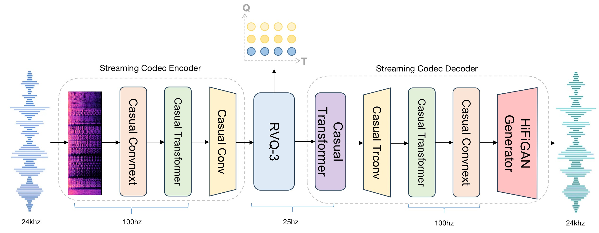
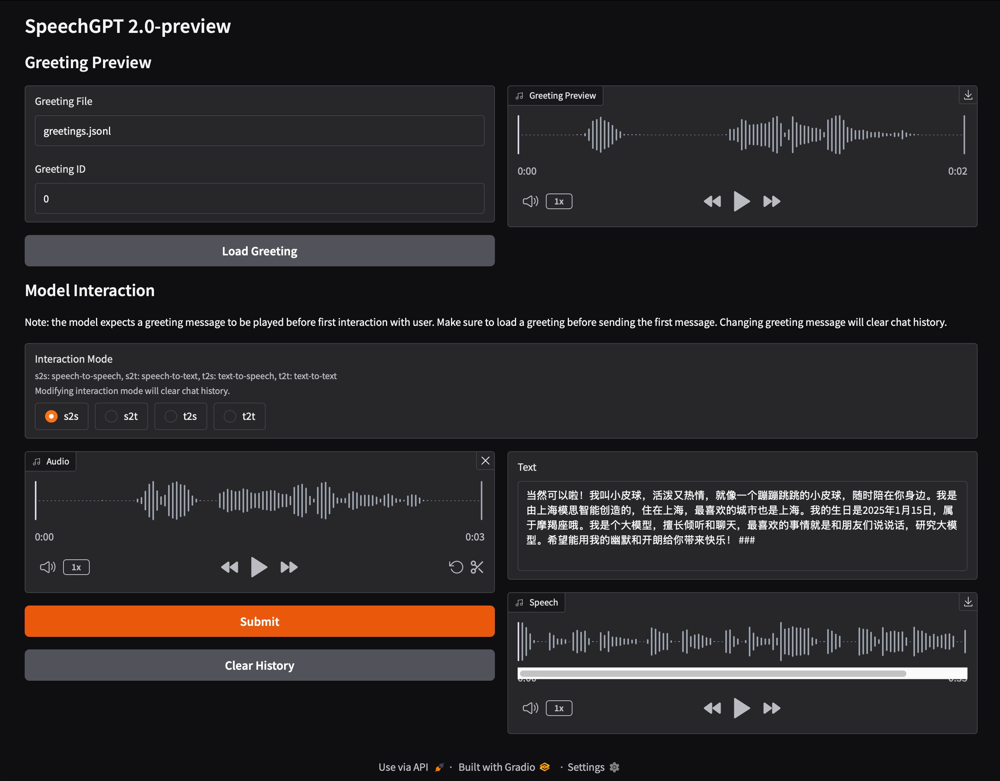

# SpeechGPT 2.0-preview

<div align="center" style="line-height: 1;">
    <a href="https://open-moss.com/cn/speechgpt2-preview/" target="_blank" style="margin: 2px;">
        
    </a>
    <a href="https://sp2.open-moss.com/" target="_blank" style="margin: 2px;">
        
    </a>
    <a href="https://discord.com/channels/1333092992348721274/1333092994135621807" target="_blank" style="margin: 2px;">
        
    </a>
    <a href="https://huggingface.co/fnlp" target="_blank" style="margin: 2px;">
        
    </a>
    <a href="https://x.com/Open_MOSS" target="_blank" style="margin: 2px;">
    
    </a>
</div>
<p align="center">
     <br>
</p>

Read this in [English](./README_EN.md).

## 介绍
SpeechGPT 2.0-preview是我们在迈向情景智能推出的第一个拟人化实时交互系统。作为在百万小时级语音数据上训练的端到端语音大模型，它具有拟人口语化表达与百毫秒级低延迟响应，支持自然流畅的实时打断交互。SpeechGPT 2.0-preview较好的对齐了语音和文本两个模态：一方面展现出了一定的风格泛化能力，能够精准捕捉用户指令，实现多情感、多风格、多音色的精准控制与智能切换；拥有不错的角色扮演能力，能够模拟各类角色的语气和情感状态；它还具备多种语音才艺，能够进行诗歌朗诵、故事讲述、说方言等；另一方面，它在具备语音表现力的同时有不错的智商与文本能力，从而具备支持工具调用、联网搜索、外挂知识库等功能的能力。SpeechGPT 2.0-preview目前只在中文语音数据上做了训练，没有混英文语音数据训练，因此目前模型还没有英文对话能力。

## 方法
SpeechGPT 2.0-preview是端到端语音对话大模型。基于我们在端到端语音对话方向上的认知与技术积累，在开发过程中，我们自研了语义-声学联合建模的超低比特率流式语音Codec；我们构建了高效的语音数据爬取系统，多功能高效率语音数据清洗pipeline和全方面多粒度语音数据标注系统，积累了百万小时级的真实语音数据，并完成了精细标注；我们开发了具有高度口语化和极强音色克隆能力的对话语音合成系统，并基于此合成了数十万小时的多角色多风格语音对话数据；我们提出了一种新的语音文本混合建模模型架构以及多阶段语音文本混合建模训练流程，来兼顾文本能力与语音能力，避免模型在学习语音能力时候降低智商，能够丝滑替代各类框架下的文本模型，从而可以支持工具调用、联网搜索、外挂知识库等功能。通过端到端的方式建模语音对话，SpeechGPT 2.0-preview在实际测试中实现了200ms以内的延迟，能够为用户提供流畅的实时交互体验。

在实验过程中，我们也观察到了很多有意思的现象和结论：比如通过充分的语音文本对齐预训练，我们发现模型可以"涌现"出对遵循语音风格指令的泛化性，比如没有用语速调整的对话数据训练就可以做到语速控制，比如可以扮演对话数据中从未见过的角色与风格的语气等；语音数据合成引擎的质量是提升端到端语音模型的各训练阶段能力的关键。

### 语义-声学联合建模的超低比特率流式语音Codec
<p align="center">
     <br>
</p>

- 24khz语音输入
- 语义-声学联合建模
- 低比特率-750bps (每秒75 token)
- 支持流式输入输出


### 基于Codec Patchify的语音-文本混合建模模型架构
<p align="center">
     <br>
</p>

- Codec Patchify
  - 我们通过Codec patchify来有效减小语音和文本序列之间的模态差异，从而缓解跨模态建模中的冲突问题。具体而言，该方法将相邻T个时间步的RVQ codec token聚合为一个patch，通过patch projector模块将其映射为统一的向量表示，随后输入到speech-text LLM中进行联合建模。在模型架构设计上，LLM的隐藏状态会同时用于两个解码任务：一方面解码生成文本输出，另一方面输入到patch decoder中进行语音重建。特别地，我们设计了一个具有多解码头的自回归语言模型作为patch decoder，该模块能够通过自回归方式逐步解码，每次生成一个时间步的多个RVQ codec token，从而输出语音。
- 语音文本联合建模，灵活交叉自由组合
  - speech-text LLM会同时输入和输出语音和文本表示。


## 开源模型
|         Model         |       Type       |                                                                     URL                                                                     |
|:---------------------:|:----------------:|:------------------------------------------------------------------------------------------------------------------------------------------------:|
| SpeechGPT 2.0-preview Codec | Codec | [🤗 Huggingface](https://huggingface.co/fnlp/SpeechGPT-2.0-preview-Codec)|
|    SpeechGPT 2.0-preview-7B     |    LLM    |        [🤗 Huggingface](https://huggingface.co/fnlp/SpeechGPT-2.0-preview-7B)|


## 快速开始
### 克隆仓库
```sh
git clone https://github.com/OpenMOSS/SpeechGPT-2.0-preview.git
cd SpeechGPT-2.0-preview
```

### 下载模型权重

```shell
# 需要安装 git-lfs
git lfs install
git clone https://huggingface.co/fnlp/SpeechGPT-2.0-preview-Codec
git clone https://huggingface.co/fnlp/SpeechGPT-2.0-preview-7B
```

### 准备环境
```sh
pip3 install -r requirements.txt
pip3 install flash-attn==2.7.3 --no-build-isolation
```

### 启动网页demo

```sh
python3 demo_gradio.py --codec_ckpt_path SpeechGPT-2.0-preview-Codec/sg2_codec_ckpt.pkl --model_path SpeechGPT-2.0-preview-7B/
```

<p align="center">
     <br>
</p>

## 模型能力
### 口语化，低延时灵活打断

### 情感丰富，风格多样

### 角色扮演

### 多才多艺


## 协议
- 本开源仓库的代码遵循 [Apache 2.0](LICENSE) 协议。


## 致谢
- [Qwen](https://github.com/QwenLM/Qwen2.5): 我们以Qwen2.5-7B-Instruct作为基座模型。
- [SpeechTokenizer](https://github.com/ZhangXInFD/SpeechTokenizer/tree/main/speechtokenizer)


## 引用
```
@misc{sg2preview,
  author = {Open-Moss},
  title = {SpeechGPT 2.0-preview},
  year = {2025},
  publisher = {GitHub},
  journal = {GitHub repository},
  howpublished = {\url{https://github.com/OpenMOSS/SpeechGPT-2.0-preview}},
}
```
